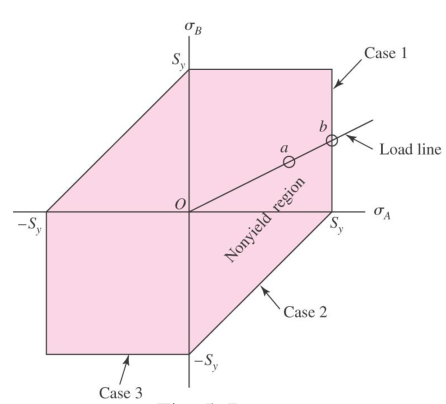
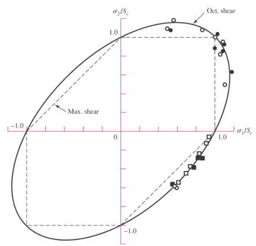

# Chapter 2 : Failure Prevention and Stress Calculation

## Table Of Contents

${toc}

## 2.1 Introduction

- __Failure:__ the state at which part of a material has separated into two or
  more separate pieces due to exhibiting inelastic behaviour.

Failure can be two types:

- Yielding: occurs in ductile materials, is due to excess inelastic deformation.
- Fracture: occurs in brittle materials, when components tear apart into two or
  more pieces.

> A material is brittle if its %EL is less than 5%. Materials with %EL more
> than 5% are considered as ductile materials.

Ductile materials can be subjected to fracture failure when they are exposed to:

- Cyclic Loading
- Long term static loading at elevated temps
- Impact Loading
- Work Hardening
- Severe Quenching

Comparing Ductile and Brittle fractures:

| Ductile Fracture | Brittle Fracture |
|--------------- | --------------- |
| Slow crack propagation (10 ft/s) | Fast crack propagation (1000ft/s) |
| Stable crack growth | Unstable crack propagation |
| Slant face fracture | Flat face fracture |
| Cup and cone fracture | Shiny fracture surface |
| Necking occurs | No necking occurs |

- __Static Load__: an unchanging force that maybe be stationary, or a couple
  that is applied to a member

This static load can result in axial tension/compression,
sheer/bending/torsional loads or a combination of some.

- __Variable Load__: an applied load that may have a changing
  magnitude/direction or both by time.

__Static Strength__

Unless the failure of the material we're designing endangers human life or if
we're planning on performing manufacturing in large quantities, it is advised
to perform design using already published strength values.

__Failure Theories__

Failure theories propose a means for comparing single strength to multiaxial
stress states based on what aspect of the stress state is critical.

- __Uniaxial stress element:__ for simple cases such as a tension test, safety
  is determined by checking for the factor of safety $(n)$

$$
n=\frac{\text{Strength}}{\text{Stress}}=\frac{S}{\sigma}
$$

- __Multi-axial stress element:__ occurs when an element with a single strength
  is exposed to complex stresses from multiple sides. For such cases, it is
  harder to compare the total stress to its strength unlike a uniaxial stress
  element.

## 2.2 Failures Resulting from Static Loading

### 2.2.1 Failure Theories for Ductile Materials

There are __three__ failure theories for ductile materials:

1. Maximum Normal Stress Theory
2. Maximum Shear-Stress Theory
3. Distortion Energy Theory

#### Maximum Normal Stress Theory

> *Yielding begins when the maximum principal stress in an element exceeds its
> yield strength*

Mohr's circle is used to find an element's largest principal strength, which is
then compared with the yield strength of the material.

It's not safe to use for ductile materials and experimental data show that it's
unsade in the 4th quadrant of the Mohr's circle.

#### Maximum Shear-Stress Theory

> *Yielding begins when the maximum shear stress is an element exceeds the
> maximum shear stress of the material when its in a tension test and begins to yield

For a tension test specimen:

- max. shear stress = $\sigma_1/2$
- at yielding, $\sigma_1=S_y$; hence max. shear stress = $S_y/2$

$\therefore$ we can say that __*"Yielding begins when maximum shear stress
exceeds $S_y/2$"*__

For principal stresses $\sigma_1\ , \sigma_2\ , \sigma_3$ where $\sigma_1 \ge
\sigma_2 \ge \sigma_3$ :

$$
\tau_{max}=\frac{\sigma_1 - \sigma_3}{2} \ge \frac{S_y}{2} \qquad or \qquad
\sigma_1 - \sigma_3 \ge S_y
$$

Incorporating factor of safety, $n$

$$
\tau_{max}=\frac{S_y}{2n} \qquad or \qquad n=\frac{S_y/2}{\tau_{max}}
$$

Comparing experimental stress data can be done as follows:

Let $\sigma_A$ and $\sigma_B$ be non-zero principal stresses, and be part of the following cases analogus to $\sigma_1 \ge \sigma_2 \ge \sigma_3$ :

- Case 1: $\sigma_A \ge \sigma_B \ge 0$
  - $\sigma_A=S_y$
- Case 2: $\sigma_A \ge 0 \ge \sigma_B$
  - $S_y \ge \sigma_A - \sigma_B$
- Case 3: $0 \ge \sigma_A \ge \sigma_B$
  - $S_n \ge - \sigma_B$

The relations can be plotted on a graph the looks similiar to the following:

#### Distortion Energy Failure Theory

> *Yielding occurs when the distortion energy per unit volume in a multiaxial
> stress state equals the distortion energy at yielding in a uniaxial tension
> test.*

In other ways, it can be expressed as :

 *Triaxial Stresses($\sigma_1$) = HydroStatic Component($\sigma_{av}$)+ Distortional Component($\sigma_1 - \sigma_{av}$)* 

- __HydroStatic Stress:__ it's the average of principal stresses

$$
\sigma_{av}=\frac{\sigma_1+\sigma_2+\sigma_3}{3}
$$

- __Strain energy per unit volume,__  

$$
u=\frac{1}{2} \left[ \epsilon_1 \sigma_1 + \epsilon_2 \sigma_2 + \epsilon_3 \sigma_3 \right]
$$

- rewriting it by subsitiuting the strain values by the generalized hooke's law [ $\epsilon_1=\frac{1}{E}(\sigma_1-\upsilon(\sigma_2+\sigma_3)$ ] :

$$
u= \frac{1}{2E} \left[ \sigma_1^2 + \sigma_2^2 + \sigma_3^2 - 2\upsilon (\sigma_1 \sigma_2 + \sigma_2 \sigma_3 + \sigma_3 \sigma_1)\right]
$$

- Strain energy for causing volume change only can be obtained by subsitiuting $\sigma_{av}$ for the principal stresses:

$$
u_v=\frac{3\sigma_{av}^2}{2E}(1-2\upsilon)
$$

- __Distortion energy:__ the difference between strain energy per unit volume and volume strain energy per unit volume  

$$
u_d=u-u_v=\frac{1+\upsilon}{3E} \left[ \frac{(\sigma_1-\sigma_2)^2 + (\sigma_2 - \sigma_3) + (\sigma_3 - \sigma_1) }{2} \right]
$$

Under tension test, the specimen at yield has $\sigma_1=S_y$ and $\sigma_2=\sigma_3=0$.

- Distortion energy for a tension test specimen becomes:

$$
u_d=\frac{1+v}{3E}S_y^2
$$

Distortion energy theory predicts failure to occur when disortion energy exceeds tensioned specimen's distortion energy, which can be expressed as follows
$$
\left[ \frac{(\sigma_1-\sigma_2)^2 + (\sigma_2 - \sigma_3) + (\sigma_3 - \sigma_1) }{2} \right]^{1/2} \ge S_y
$$

- The left side of the equation is called __von Mises stress ($\sigma '$)__
  - For plane stresses:
    $$
    \sigma ' = (\sigma_A ^2 - \sigma_A \sigma_B + \sigma_B^2 )^{1/2}
    $$
    -For plane stress with xyz components:
    $$
    \sigma ' =  (\sigma_x ^2 - \sigma_x \sigma_y + \tau_{xy}^2 )^{1/2}
    $$

- Comparing von Mises stress to yield strength:

$$
\sigma ' \ge S_y
$$

- Expressing it with a factor of safety:

$$
\sigma ' \ge \frac{S_y}{n} \qquad n=\frac{S_y}{\sigma '}
$$

Plotting von Mises stress on principal stress axes results in an __ellipitcal shape__, and experimental data typically lie around it.

- According to MSS theory, the intersection of loadline with failure line, results in the shear strength ($S_{sy}$) of :

$$
S_{sy}=0.5Sy
$$

- The corresponding shear strength for Distortion energy theory is due to shear stress, which can be expressed as:

$$
(3\tau_{xy}^2)^(1/2) = S_y \qquad \tau_{xy}=S_{yy}=\frac{S_y}{\sqrt3}=0.577S_y
$$

### 2.3 Fatigue Failure Due to Variable Loading

Variable loading produces variable, fluctuating stresses that lead to failure by sudden unlimate fracture. No visible warning is percieved before the fracture since the stress at failure is below yield strength.
